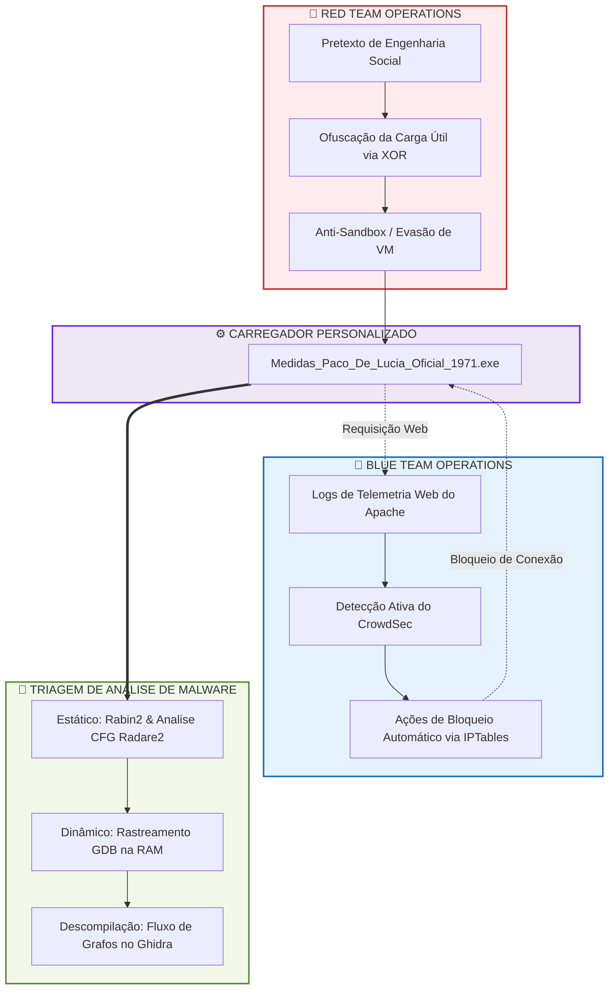

## 🎻 Operation Luthieria Flamenca: Artifact Analysis & Purple Team Lab

This repository contains the full Purple Team lifecycle simulation of a targeted social engineering campaign named Operation Luthieria Flamenca. The lab demonstrates the creation, analysis, and active defensive mitigation of an obfuscated stage-1 loader designed to drop a 64-bit Meterpreter shellcode under the guise of an technical flamenco documentation file (Medidas_Paco_De_Lucia_Oficial_1971.pdf).

## 🗺️ Project Lifecycle Map



## ⚔️ Purple Team Direct Portals

🔴 Offensive Operations [Red Team Source:](https://github.com/edenzafire/Red_Team_Repo/tree/main/03_Social_Engineering) Phishing Campaign & Payload Generation

🔵 Defensive Operations [Blue Team Analysis:](https://github.com/edenzafire/Blue_Team_Repo/tree/main/03_Identity_Access_Management_IAM) Technical Write-Up & Artifact Deobfuscation

📂 Repository Directory Structure

## String-Decoy03SocialEnginering/
```
>├── docs/                   # Additional documentation, flowcharts, and technical specifications
>├── src/                    # Source code files (Loader, Python encryptor, Linux debug stub)
>├── screenshots/            # Chronological lab evidence logs (01 to 23)
>├── WriteUps/               # Detailed, technical step-by-step forensic case reports
└── README.md               # Welcome portal and project map (This file)
```


## 🔬 Core Analysis Milestones Demonstrated

*1. Architectural Static Triage*

Header Inspection: Identification of the Windows PE32+ signature disguised in DOS headers (MZ / 0x4d5a).

Import Mapping: Structural extraction of Process Injection APIs via rabin2 (e.g., VirtualAlloc, VirtualProtect, CreateThread, Sleep).

Heuristic String Extraction: Detection of VM-specific drivers (VirtualBox/VMware markers) used as sandbox triggers.


*2. Assembly Level Disassembly & CFG Analysis (Radare2)*

Mapped control-flow redirection routines.

Uncovered timing bypasses and anti-debugging loops dynamically querying KERNEL32.dll!Sleep via indirect execution pointers (call r12).


*3. Dynamic Memory Decryption Carving (GDB)*

Monitored the volatile memory state during XOR runtime loops.

Extracted the plaintext payload directly out of the allocation buffer, proving the execution of an aligned x64 Metasploit payload via signature bytes carving (0xfc 0x48 0x83 0xe4 0xf0).


*4. Code Decompilation & Graph Topology (Ghidra)*

Validated decision-making trees inside the compiled loader using control flow graphs.

Analyzed execution path branching (True/Green vs. False/Red paths) in the presence of anti-sandbox conditions.


*5. Containment & Remediation (CrowdSec)*

Modeled the attack footprint on web access logs.

Configured automated response triggers using CrowdSec agent Docker containers to drop connection streams before artifact acquisition.


## 🛠️ How to Navigate the Lab Artifacts

Read the Full Report: Open the complete investigation write-up in the WriteUps/case-report.md folder.

Examine the Source: Review the C++ source and dynamic debug adaptation code in the src/ directory.

Verify Evidences: Follow along with the visual proof markers located in the screenshots/ catalog.

Disclaimer: This repository is intended strictly for educational, security research, and defensive development purposes under Purple Team simulation models.
