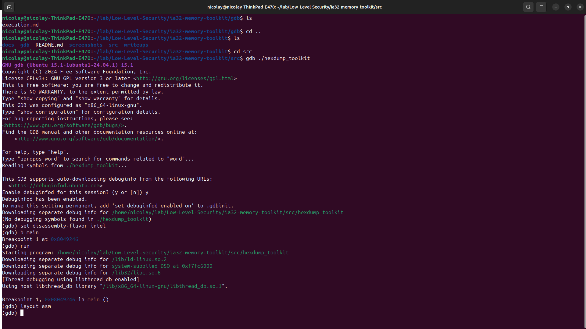
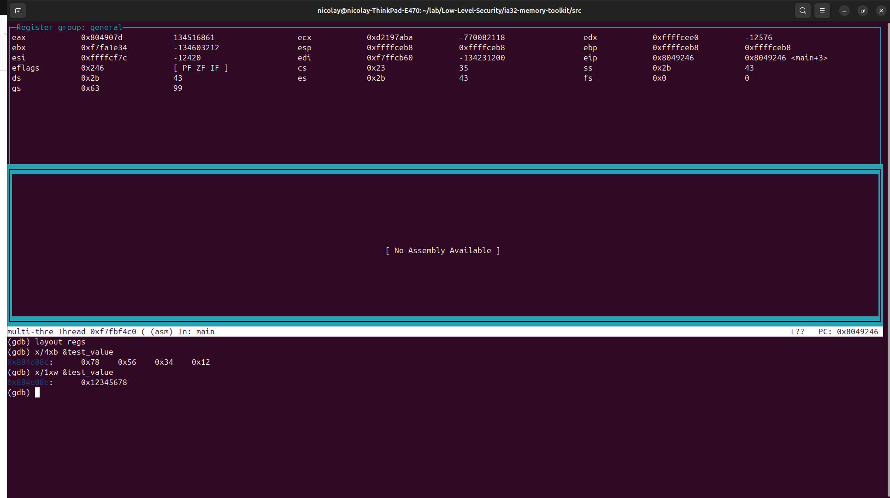
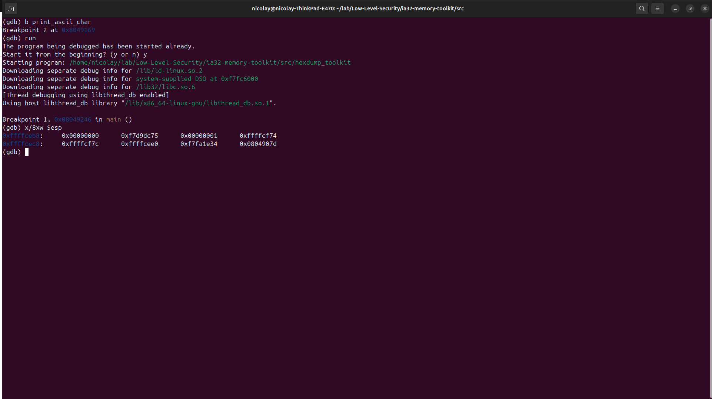

# 🕵️ Technical Write-up: Internal Mechanics of an IA-32 Hexdump Engine

**Author:** Zafire Daniel 
**Target:** IA-32 Architecture / Memory Inspection  
**Date:** April 2026

---

## 0x01: The Challenge

The goal of this project was to build a memory inspection toolkit from scratch using **IA-32 Assembly**. The challenge went beyond simply printing hexadecimal values; it required maintaining a clean execution environment and deeply understanding how the processor actually "sees" and organizes data in physical memory.

## 0x02: The Stack Preservation Battle

One of the primary hurdles in low-level development is the interaction with C library functions (such as `printf`). In the IA-32 architecture, calling an external function can be "destructive" to your current register state.

* **Problem:** The `printf` function is free to use and modify the `eax`, `ecx`, and `edx` registers. However, my main processing loop heavily depended on `ecx` as a counter and `esi` as the source index.
* **Solution:** Implementation of strict stack management. I utilized `push` and `pop` operations to "freeze" my execution state before handing control over to the library function.

### Code Analysis: Preservation Pattern
```assembly
# Preservation pattern used in the project
pushl %ebx            # Save caller-saved register
pushl %esi            # Save current memory index
call print_ascii_char # Execute the printing logic
addl $4, %esp         # Clean up the stack (cdecl convention)
popl %esi             # Restore memory index
popl %ebx             # Restore ebx
```
Initial debugging setup to monitor register state.


## 0x03: The Endianness Revelation
During the debugging phase, a classic "low-level moment" occurred. When attempting to dump a 32-bit integer constant 0x12345678, the physical memory output revealed:
78 56 34 12

Analysis:
This observation confirms the Little-Endian nature of the Intel IA-32 architecture. The Least Significant Byte (LSB) is stored at the lowest (starting) address. My engine successfully demonstrated the real-world discrepancy between human-readable logical values and their physical representation in system RAM.

Verification of byte swapping in physical memory (0x12345678 -> 78 56 34 12).


## 0x04: Debugging with GDB (The "Coldwind" Way)
A security researcher does not trust the code; they verify its behavior. Following the methodology of researchers like Gynvael Coldwind, I used GDB to inspect the stack frame during live execution.

Snippet de código
(gdb) x/8xw $esp

In-depth analysis of the stack frame, locating return addresses and function arguments.


In the memory dump (referenced in screenshots/04-stack-frame-inspection.png), we can clearly identify the return address sitting at the top of the stack, immediately followed by the function arguments. Understanding this mechanism is the absolute foundation for mastering advanced security topics such as Buffer Overflows and ROP (Return-Oriented Programming) chains.

## 0x05: Final Thoughts
Developing this tool provided a deep dive into the IA-32 calling conventions and memory management. This project reinforces the idea that in cybersecurity, it is not about the complexity or size of the code, but about having absolute control over every single byte moving through the CPU registers.


