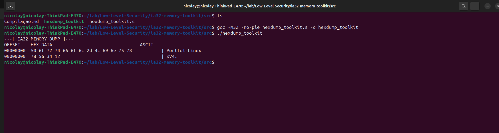

# 🕵️ IA-32 Low-Level Toolkit


Low-level memory inspection toolkit written in **IA-32 Assembly (x86 32-bit)**. 

This repository contains exercises, experiments, and tooling developed during my studies of IA-32 architecture, stack frames, memory addressing modes, and debugging workflows on a ThinkPad E470 running Debian 12.

---

## 🚀 Key Features & Learning Focus
The project demonstrates practical usage of:
* **Stack Frame Construction:** Manual handling of `EBP` and `ESP`.
* **Pointer Walking:** Memory traversal using `ESI` and `EDI`.
* **Calling Conventions:** Implementation of the `cdecl` convention via stack.
* **Endianness Analysis:** Practical visualization of physical vs. logical memory storage.
* **Advanced Debugging:** Deep dives using **GDB** (GNU Debugger).

---

## 📖 Deep Dive Write-ups (Gynvael Coldwind Style)
To understand the research mindset behind this project, check out the detailed technical reports:
👉 [**Technical Write-up: Internal Mechanics of the Engine**](writeups/01-ia32-memory-dumping.md)

---

## 🖼️ Execution & Results

### Example Output
The hexdump engine processing strings and numeric values in the laboratory environment:



### Endianness Visualization (Intel IA-32)
Observe how the logical hexadecimal value `0x12345678` is physically displayed:
`78 56 34 12`

> **Insight:** This demonstrates the **Little-Endian** pattern, where the Least Significant Byte (LSB) is stored at the lowest memory address. 

---

## 🏗️ Repository Structure

* **`src/`**: IA-32 Assembly source files.
* **`docs/`**: Course certificates (INTUIT) and technical study notes.
* **`gdb/`**: Debugging session logs and register inspection guides.
* **`screenshots/`**: Visual examples of execution and memory analysis.
* **`writeups/`**: Detailed documentation and reverse-engineering style explanations.

---

## 🛠️ Implemented Components

* **`hex_ascii_dump()`**: Memory traversal and byte visualization engine.
* **`print_ascii()`**: Helper for printable ASCII character detection (security filters).
* **`string analyzer`**: (Planned extension) Character classification engine.

---

## 💻 How to Build and Run

To compile on 64-bit Linux systems (like Debian/Ubuntu), you will need `gcc-multilib`:

```bash
# 1. Install dependencies
sudo apt install gcc-multilib gdb -y

# 2. Compile (IA-32, No-PIE for fixed addresses)
gcc -m32 -no-pie src/hexdump_toolkit.s -o hexdump_toolkit

# 3. Execute
./hexdump_toolkit

```
---

## 🎓 Academic Reference

This project was developed as part of my structured learning path in computer architecture and systems security.

* **Course:** IA-32 Assembly Programming and Computer Architecture
* **Provider:** NOU INTUIT (Independent Non-Commercial Educational Organization "INTUIT")
* **Status:** Completed / Certified
* **Focus:** Low-level programming, memory management, and hardware-software interface.

🔗 [Official Course Link](https://intuit.ru/studies/courses/3537/779/info)

### **Verification & Certification**
The certificates issued upon successful completion are available for verification:
* 📜 [Russian Version (Original)](docs/certificateRu.jpg)
* 📜 [English Version (Translated)](docs/certificateIn.jpg)

---

## 👨‍💻 Author

**Zafire Daniel** *Cybersecurity Student & Low-level Enthusiast* Dedicated to mastering the internals of computing systems to better understand software security and vulnerability research. My current focus includes:
* **Reverse Engineering:** Analyzing binary behavior and control flow.
* **Memory Analysis:** Building tooling for forensic and security inspections.
* **Assembly Internals:** Writing efficient and secure code at the architecture level.

---
*Generated by Zafire's Security Lab - 2026*
